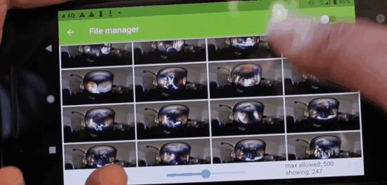

# Oppkey THETA API Test Kit

Tools to test the [RICOH THETA Web API](https://api.ricoh/docs/theta-web-api-v2.1/) on different
camera models.

## Background

Oppkey is a developer relations firm in Silicon Valley under contract
with RICOH to help businesses build solutions for RICOH THETA camera.

After helping dozens of companies deploy thousands of RICOH THETA
cameras in products for used car, real estate, and construction
markets, we've
built up common tests based on questions from businesses about
the camera behavior. RICOH considers these companies partners and
relies on Oppkey to support high-quality developer relations services.

The Oppkey THETA API Test Kit (ATK) are the tools we use internally to
test camera behavior such as delay between commands, configuring
multiple camera settings in sequence, status checks at the end of
bracket or interval shooting, thumbnail requests, and live preview
(motionJPEG) management.

We get more questions from RICOH partners every week and update
this API Test Kit regulary in order to help more people in the
future.

Feel free to use these tools yourself to experiment with the camera,
build a prototype or replicate the results of our tests.

## ATK Contents

* theta - Dart library for the RICOH THETA Web API
* opptheta - command line tester built on the theta library.
Runs natively on Linux,
Windows, Mac as well as platforms such as Raspberry Pi and
NVIDIA Jetson
* thetaf - Flutter widgets for elements such as
displaying live preview on RICOH THETA cameras
* oppkey_theta_atk_flutter - demonstration of using the theta
and thetaf packages on mobile or desktop applications

## Mobile App Testing

The command line scripts can run on iOS and Android devices using
Flutter.

Mobile app demonstrations can show the expected behavior of the API
or workaround.  For Example, the demonstration above shows a workaround
for the SC2 camera.listFiles problem with returning thumbnail data.

The demonstration shows 343 thumbnails from the SC2, quickly illustrating
that it's possible to pull all the thumbnail images from the camera.

## Summary of Findings

* camera.listFiles only shows 100 files regardless of if entry count is higher.  Example  startPosition workaround
* SC2 API to get thumbnails is broken when using `camera.listFiles` and
`maxThumbSize` of 640. [more information](docs/sc2/thumbnail_problem.md)  TODO: add summary of test to this repo and workaround
* SC2 live preview stops when other API commands are given. TODO: test
* cannot set preview parameters of SC2 live preview. TODO: test and document
* SC2 check for camera status after interval or bracket shooting
* SC2 camera._getMetadata API not working properly: TODO: update test with newest firmware
* SC2 takes longer to be ready for next command, likely due to slower CPU. TODO: test camera status
* SC2 `/osc/commands/status` not working as expected with bracket shooting "ready for next command"

## Tips and HowTo

* using the API with my settings

---

## Project Contribution

| Goal | Explanation | Example |
| ---- | ------- | ------- |
| awareness | API problem or difference.  API feature. | SC2 API thumbnails not appearing in `camera.listFiles` when `thumbSize` set to 640 [video example](https://youtu.be/ZAiZy53YtkU) |
| workaround | Psuedo code. Explanation. Code snippet | Loop through list of file URLs and append `?type=thumb`  [example article](https://drive.google.com/file/d/1KvPfBI_90XfA9Y77Jz2eyDFN2Ot99sef/view) |
| demonstration | Show expected behavior. | [example GitHub demo](https://github.com/codetricity/theta_list_files) |
