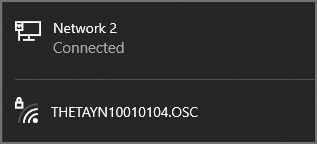
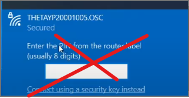
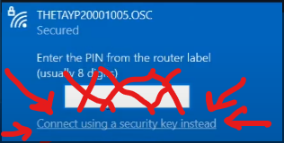
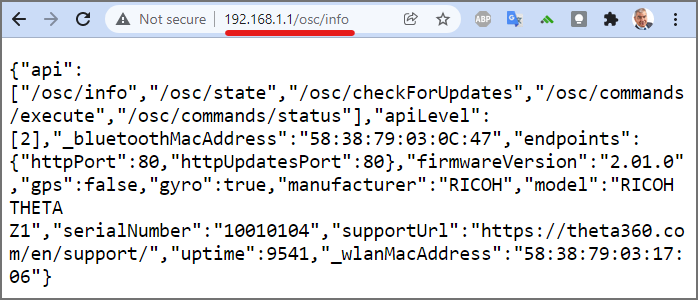
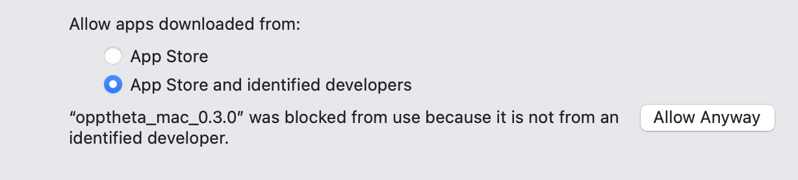

# opptheta

command line API tester for RICOH THETA cameras.


## Running opptheta

* Windows `.\opptheta.exe`
* Linux `./opptheta`
* Mac OS - see troubleshooting section

## Camera Connection Setup

Connect RICOH THETA to computer with Wi-Fi in access point (AP) mode.
The THETA will be at 192.168.1.1.

Ideally, you have two network interfaces.  For example, an
inexpensive Wi-Fi USB adapter will work fine.

The network interface for your Internet router or hotspot must
not be a 192.168.1.1 or will interfere with the THETA IP address.



The password is the numbers only.  In the example above, the password
is 10010104.

If you cannot connect your computer to the camera, refer to the troubleshooting
section.

## Available Commands

Use `./opptheta --help` or `./opptheta command --help` to see options.

```
> .\opptheta --help
RICOH THETA Live Preview tester

Usage: opptheta <command> [arguments]

Global options:
-h, --help    Print this usage information.

Available commands:
  checkForIdle       wait for camera to be idle after startCapture or self timer for next command
  getLastFileInfo    get info for last file taken
  getLastImageUrl    get url for last image taken
```

## Example Usage

### Take Picture and Show Camera Status

Test is with the Z1.

```
> .\opptheta takePictureReady
In progress after: 1285 milliseconds
In progress after: 2503 milliseconds
ready for next command after 3091 milliseconds
```

## Show All Options

```
> .\opptheta getZ1Options
{
  "name": "camera.getOptions",
  "results": {
    "options": {
      "aperture": 0,
      "_authentication": "digest",
      "_autoBracket": {
...
      "_microphoneChannel": "4ch+1ch",
      "_networkType": "AP",
      "offDelay": 600,
      "previewFormat": {
        "framerate": 30,
        "height": 512,
        "width": 1024
      },
      "remainingPictures": 2476,
      "remainingSpace": 20839510016,
      "remainingVideoSeconds": 2825,
      "shutterSpeed": 0,
      "_shutterVolume": 100,
      "sleepDelay": 65535,
      "_timeShift": {
        "firstInterval": 5,
        "firstShooting": "front",
        "secondInterval": 5
      },
      "_topBottomCorrection": "Apply",
      "totalSpace": 21055815680,
      "videoStitching": "ondevice",
      "_visibilityReduction": "OFF",
      "whiteBalance": "auto",
      "_wlanFrequency": 2.4
```

### Save Thumbnails

Z1

```shell
> .\opptheta.exe thumb --save 2
```

Thumbnails will be saved in thumbs directory.


For RICOH THETA SC2, add `--sc2=true`.

## Test Live Preview

Z1 only.

Save 5 frames of motion JPEG to local filesystem.

```
> .\opptheta.exe saveFrames
framecount 1
framecount 2
framecount 3
framecount 4
framecount 5
```

The motion JPEG frames from live preview will be saved in
`theta_frames`.

```
Mode                 LastWriteTime         Length Name
----                 -------------         ------ ----
d-----        11/17/2021   2:21 PM                theta_frames
d-----        11/17/2021   2:17 PM                thumbs
-a----        11/17/2021   1:55 PM        6439792 opptheta.exe
```


## Test Live Preview Stability

Z1 only.

Save 300 frames.

```
> .\opptheta.exe saveFrames --frames=300
framecount 1
framecount 2
framecount 3
framecount 4
```


## Check Last Image

```
> .\opptheta.exe getLastImageUrl
http://192.168.1.1/files/150100524436344d42013765da9bc400/101RICOH/R0020015.JPG
```

Copy and paste URL into browser or CTRL-click on URL in most terminal windows.


Save image to local filesystem to inspect with RICOH THETA desktop app.


## Troubleshooting

### Cannot Connect on Windows


See this video for more information.  

[Connecting to RICOH THETA cameras in Access Point mode](https://youtu.be/WdaXk8y0B20)


Use a security key, not the PIN.



Click on the link that says, _Connect using a security key instead_.



### No connection to camera

```shell
> .\opptheta_windows_0.3.0.exe info
*********************** 
Command failed.  First check if the camera is
connected with Wi-Fi.  Try pinging the camera.
In access point mode, the camera is always at 192.168.1.1
verify that you do not have your home or office router on that same
```

Test with ping.

```
> ping 192.168.1.1

Pinging 192.168.1.1 with 32 bytes of data:
Reply from 192.168.1.179: Destination host unreachable.
Reply from 192.168.1.179: Destination host unreachable.

Ping statistics for 192.168.1.1:
    Packets: Sent = 2, Received = 2, Lost = 0 (0% loss),
Control-C
```

If ping fails, the camera is likely not connected to your computer.

If the camera is connected, you will see a response as follows:

```
> ping 192.168.1.1

Pinging 192.168.1.1 with 32 bytes of data:
Reply from 192.168.1.1: bytes=32 time=4ms TTL=64
Reply from 192.168.1.1: bytes=32 time=3ms TTL=64
Reply from 192.168.1.1: bytes=32 time=2ms TTL=64
Reply from 192.168.1.1: bytes=32 time=3ms TTL=64

Ping statistics for 192.168.1.1:
    Packets: Sent = 4, Received = 4, Lost = 0 (0% loss),
Approximate round trip times in milli-seconds:
    Minimum = 2ms, Maximum = 4ms, Average = 3ms
PS C:\Users\craig\Documents\Development\ricoh\oppkey_theta>
```

If the camera is connected and you cannot run `./opptheta info` then
test the connection with a web browser to 'http://192.168.1.1/osc/info'.



If you are still not getting a response from `opptheta`, then try curl.

```shell
$ curl http://192.168.1.1/osc/info
{"api":["/osc/info","/osc/state","/osc/checkForUpdates","/osc/commands/execute","/osc/commands/status"],"apiLevel":[2],"_bluetoothMacAddress":"58:38:79:03:0C:47","endpoints":{"httpPort":80,"httpUpdatesPort":80},"firmwareVersion":"2.01.0","gps":false,"gyro":true,"manufacturer":"RICOH","model":"RICOH THETA Z1","serialNumber":"10010104","supportUrl":"https://theta360.com/en/support/","uptime":9673,"_wlanMacAddress":"58:38:79:03:17:06"}
```

### Mac OS

Set permissions to `chmod +x` and in System Preferences under Security click "Allow Anyway"

