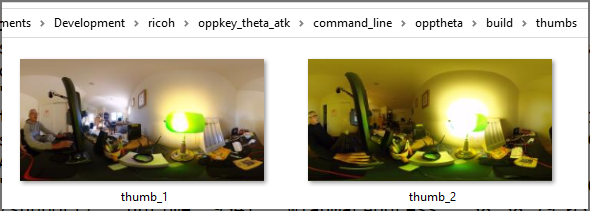

# opptheta

command line API tester for RICOH THETA cameras.


## Running opptheta

* Windows `.\opptheta.exe`
* Linux `./opptheta`
* Mac OS - see troubleshooting section of connection document

## Available Commands

Use `./opptheta --help` or `./opptheta command --help` to see options.

```shell
> .\opptheta --help
RICOH THETA Live Preview tester

Usage: opptheta <command> [arguments]

Global options:
-h, --help    Print this usage information.

Available commands:
  checkForIdle       wait for camera to be idle after startCapture or self timer for next command
  getLastFileInfo    get info for last file taken
  getLastImageUrl    get url for last image taken
```

## Example Usage

### Take Picture and Show Camera Status

Test is with the Z1.

```shell
> .\opptheta takePictureReady
In progress after: 1285 milliseconds
In progress after: 2503 milliseconds
ready for next command after 3091 milliseconds
```

## Show All Options

```shell
> .\opptheta getZ1Options
{
  "name": "camera.getOptions",
  "results": {
    "options": {
      "aperture": 0,
      "_authentication": "digest",
      "_autoBracket": {
...
      "_microphoneChannel": "4ch+1ch",
      "_networkType": "AP",
      "offDelay": 600,
      "previewFormat": {
        "framerate": 30,
        "height": 512,
        "width": 1024
      },
      "remainingPictures": 2476,
      "remainingSpace": 20839510016,
      "remainingVideoSeconds": 2825,
      "shutterSpeed": 0,
      "_shutterVolume": 100,
      "sleepDelay": 65535,
      "_timeShift": {
        "firstInterval": 5,
        "firstShooting": "front",
        "secondInterval": 5
      },
      "_topBottomCorrection": "Apply",
      "totalSpace": 21055815680,
      "videoStitching": "ondevice",
      "_visibilityReduction": "OFF",
      "whiteBalance": "auto",
      "_wlanFrequency": 2.4
```

### Save Thumbnails

Z1

```shell
> .\opptheta.exe thumb --save 2
```

Thumbnails will be saved in thumbs directory.



For RICOH THETA SC2, add `--sc2=true`.

## Test Live Preview

Z1 only.

Save 5 frames of motion JPEG to local filesystem.

```shell
> .\opptheta.exe saveFrames
framecount 1
framecount 2
framecount 3
framecount 4
framecount 5
```

The motion JPEG frames from live preview will be saved in
`theta_frames`.

```
Mode                 LastWriteTime         Length Name
----                 -------------         ------ ----
d-----        11/17/2021   2:21 PM                theta_frames
d-----        11/17/2021   2:17 PM                thumbs
-a----        11/17/2021   1:55 PM        6439792 opptheta.exe
```


## Test Live Preview Stability

Z1 only.

Save 300 frames.

```
> .\opptheta.exe saveFrames --frames=300
framecount 1
framecount 2
framecount 3
framecount 4
```


## Check Last Image

```
> .\opptheta.exe getLastImageUrl
http://192.168.1.1/files/150100524436344d42013765da9bc400/101RICOH/R0020015.JPG
```

Copy and paste URL into browser or CTRL-click on URL in most terminal windows.


Save image to local filesystem to inspect with RICOH THETA desktop app.


