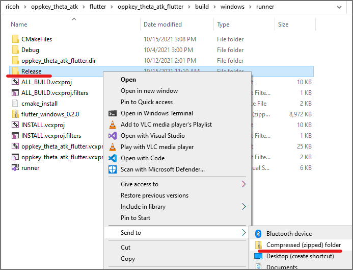
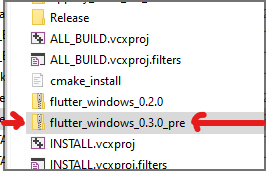

# opptheta_f

Demonstration of using RICOH THETA API with Flutter

## Development

### Build for Windows release

#### Step 1 - Build binary

```
\oppkey_theta_atk\flutter\opptheta_f> flutter build windows

💪 Building with sound null safety 💪

Building Windows application...
```

#### Step 2 - cd into project_root\build\windows\runner\Release

#### Step 3 - copy library files from C:\Windows\System32

* `msvcp140.dll`
* `vcruntime140.dll`
* `vcruntime140_1.dll`

```
> ls
    Directory: C:\Users\craig\Documents\Development\ricoh\oppkey_theta_atk\flutt
    er\opptheta_f\build\windows\runner\Release

Mode                 LastWriteTime         Length Name
----                 -------------         ------ ----
d-----        10/15/2021   3:08 PM                data
-a----         9/30/2021   7:04 PM       13878784 flutter_windows.dll
-a----         8/30/2021   9:53 PM         565648 msvcp140.dll
-a----        10/15/2021   3:08 PM          76288 opptheta_f.exe
-a----         8/30/2021   9:54 PM          97168 vcruntime140.dll
-a----         8/30/2021   9:53 PM          37240 vcruntime140_1.dll
```

#### Step 4 - zip folder for distribution



#### Step 5 - rename archive bundle

* use suffix `pre` for pre-release if you need to share the package with
new features ahead of release


