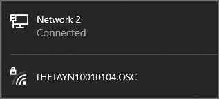
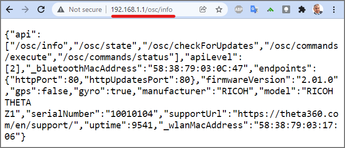
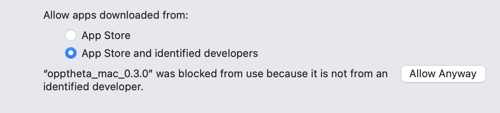

# Connecting a RICOH THETA Camera to Your Computer or Mobile Phone


## Camera Connection Setup

Connect RICOH THETA to computer with Wi-Fi in access point (AP) mode.
The THETA will be at 192.168.1.1.

Ideally, you have two network interfaces.  For example, an
inexpensive Wi-Fi USB adapter will work fine.

The network interface for your Internet router or hotspot must
not be a 192.168.1.1 or will interfere with the THETA IP address.



The password is the numbers only.  In the example above, the password
is 10010104.

If you cannot connect your computer to the camera, refer to the troubleshooting
section.

## Troubleshooting

### Cannot Connect on Windows


See this video for more information.  

[Connecting to RICOH THETA cameras in Access Point mode](https://youtu.be/WdaXk8y0B20)


Use a security key, not the PIN.


Click on the link that says, _Connect using a security key instead_.


### No connection to camera

```shell
> .\opptheta_windows_0.3.0.exe info
*********************** 
Command failed.  First check if the camera is
connected with Wi-Fi.  Try pinging the camera.
In access point mode, the camera is always at 192.168.1.1
verify that you do not have your home or office router on that same
```

Test with ping.

```
> ping 192.168.1.1

Pinging 192.168.1.1 with 32 bytes of data:
Reply from 192.168.1.179: Destination host unreachable.
Reply from 192.168.1.179: Destination host unreachable.

Ping statistics for 192.168.1.1:
    Packets: Sent = 2, Received = 2, Lost = 0 (0% loss),
Control-C
```

If ping fails, the camera is likely not connected to your computer.

If the camera is connected, you will see a response as follows:

```
> ping 192.168.1.1

Pinging 192.168.1.1 with 32 bytes of data:
Reply from 192.168.1.1: bytes=32 time=4ms TTL=64
Reply from 192.168.1.1: bytes=32 time=3ms TTL=64
Reply from 192.168.1.1: bytes=32 time=2ms TTL=64
Reply from 192.168.1.1: bytes=32 time=3ms TTL=64

Ping statistics for 192.168.1.1:
    Packets: Sent = 4, Received = 4, Lost = 0 (0% loss),
Approximate round trip times in milli-seconds:
    Minimum = 2ms, Maximum = 4ms, Average = 3ms
PS C:\Users\craig\Documents\Development\ricoh\oppkey_theta>
```

If the camera is connected and you cannot run `./opptheta info` then
test the connection with a web browser to 'http://192.168.1.1/osc/info'.



If you are still not getting a response from `opptheta`, then try curl.

```shell
$ curl http://192.168.1.1/osc/info
{"api":["/osc/info","/osc/state","/osc/checkForUpdates","/osc/commands/execute","/osc/commands/status"],"apiLevel":[2],"_bluetoothMacAddress":"58:38:79:03:0C:47","endpoints":{"httpPort":80,"httpUpdatesPort":80},"firmwareVersion":"2.01.0","gps":false,"gyro":true,"manufacturer":"RICOH","model":"RICOH THETA Z1","serialNumber":"10010104","supportUrl":"https://theta360.com/en/support/","uptime":9673,"_wlanMacAddress":"58:38:79:03:17:06"}
```

### Mac OS

Set permissions to `chmod +x` and in System Preferences under Security click "Allow Anyway"


